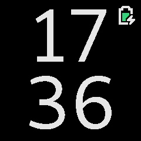
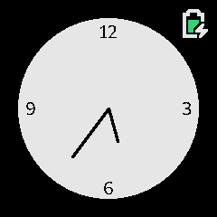
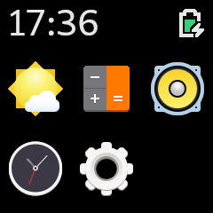
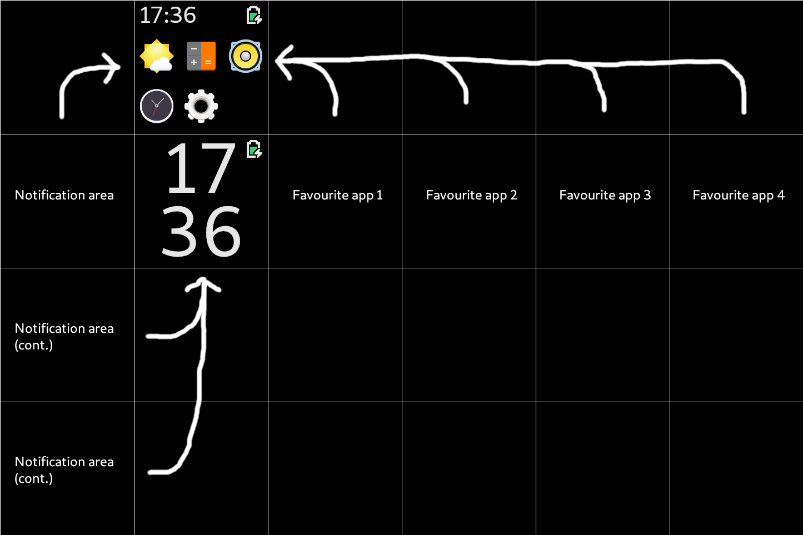
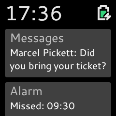
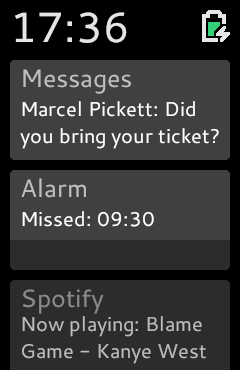
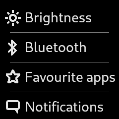
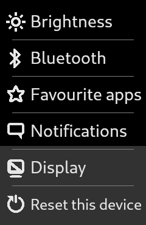
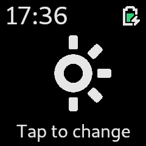

# PineTimeOS





This repository contains designs and assets for a UI for the PineTime. The icons I use for apps and symbols are taken from the [GNOME Project](https://gnome.org), more specifically the [Adwaita theme](https://github.com/GNOME/adwaita-icon-theme). No code of my own is included for now.

## Icons

I'm providing LVGL-style bitmap .h files in the assets folder alongside their png's.

See [the LVGL documentation](https://docs.lvgl.io/latest/en/html/widgets/img.html) for how to draw images.

To get transparency to work, set LV_COLOR_TRANSP in your lv_conf.h (in apps/your_app to the color 6cfc6a (I'm not sure how: replacing LV_COLOR_LIME with 0x6cfc6a did not work, it needs to be in a different format).

## UI Layout

1. Main watchface
2. Favourite apps 1, 2, 3 and 4
3. App overview (show a grid of all apps, swipe right to see more apps (if there are more than 6 apps))
4. Notification overview

Every number represents a 240x240 screen shown on the watch.

```
-------------------------
| 3 | 3 | 3 | 3 | 3 | 3 |
-------------------------
| 4 | 1 | 2 | 2 | 2 | 2 |
-------------------------
| 4 |
-----
| 4 |
-----
```

When entering 3 and 4, fade in and show the battery and time on a top bar.
When a notification comes in, automatically switch to 4 (and turn on the display if set).



Here's a WIP mockup of what the whole UI should look like. Note that this overview isn't representative of how the UI is actually drawn. This purely shows which screen/app appears when you swipe somewhere. For example, when you swipe upwards from Home, you'll find yourself in the App menu app.

## Apps

Every app except Home shows the time in digital format on the top left, and the battery and bluetooth icons on the top right. These stay even when swiping to other apps. Home only shows the battery (Or at least on the watchfaces I made. Other watchfaces can choose to draw whatever they want.)

Most apps described here are just ideas, and don't need to be built immediately.

### Home


The main watchface. Gets shown on button press / on screen enable. The above images are examples of what Home may look like. Ideally the user can set their own watchface by selecting a Home app at runtime (in Settings->Favourite apps).

### App menu


Shows a 3x2 grid of app icons (and the title of the app, if there's space for that). If there are more than 6 apps, you can swipe right to see more apps. Make this 2x2 if the buttons are too small. LVGL: Maybe use lv_tabview for this? on swipe right event, move to next tab, on swipe left, move to previous tab. Hide the tab buttons using `lv_tabview_set_btns_hidden(tabview,  true);`

### Notifications




Swipe right from your home screen and you'll see your notifications. If there are more than can fit on the screen, you can scroll down to see the rest. Tap on a notification to instantly go to the relevant app.

### Clock

Stopwatch, timer and alarm app.

### Music

Control music playback of your phone through bluetooth.

### Weather

See a nice overview of the weather. Show the temperature, humidity, etc. This is completely reliant on smartphone app functionality.

### Heartbeat

Show information of the heartbeat sensor. Maybe draw a nice graph of the past hour, or even 24 hours if there's space.

### Step counter

Count your steps. Make an estimation of how many miles/kilometres you have walked/ran. Has a button to reset the counter.

### Settings




This app is used to customize your watch and connect to your phone with Bluetooth. The app shows a list (similar to the current menu_tiles, except every item in the list has an icon if possible) of all the settings in which you can scroll up and down. 

Settings are stored by placing variables in flash, so that the settings are not lost on reboot. You could also do without since smartwatches are very rarely rebooted, but it can be a bummer to turn on your watch after it died and you see all your favourite apps and settings set up wrong.

Below is every useful setting + its mockup that I can think of.

##### Brightness



Change the brightness of the screen. On tap, the brightness changes (LOW->MID, MID->HIGH, HIGH->LOW).

##### Bluetooth

This screen shows Bluetooth settings:
- Connect to device (show pairing code and confirmation buttons here)
- Disconnect from device
- Turn bluetooth on/off

##### Favourite apps

This setting allows you to set which watchface is assigned as the default home 'app'. You can also set which app is favourite app 1, 2, 3 and 4 (see UI layout). These will then be shown in order if you swipe right from the home screen. Maybe also add an option to set how many favourite apps you want.

##### Notifications

This screen shows notification settings, if there is a notification feature.
- Vibrate on incoming notification?
- Switch to notification on incoming notification?
- Turn on display on incoming notification?

##### Display

This screen lets you choose between the following options:
- Choose when the display turns on:
	- Keep the display always on
	- Turn on the display when holding the watch upwards, or on tap or button press.
	- Turn on the display on tap or button press
	- Turn on the display on button press only
- Time until the display goes back to sleep (options: 5s, 10s, 30s, off)

##### Reset this device

This shows a confirmation dialog on whether the user wants to reboot the device. When 'yes' is pressed, reboot the device. On 'no', go back to the settings screen.

## Battery icon information

### Images to use per battery life percentage

Battery life | Icon | Icon when charging
-------------|------|---------------------
100 to 90 | os_battery_100 | os_batterycharging_100
90 to 80 | os_battery_090 | os_batterycharging_090
80 to 70 | os_battery_080 | os_batterycharging_080
70 to 60 | os_battery_070 | os_batterycharging_070
60 to 50 | os_battery_060 | os_batterycharging_060
50 to 40 | os_battery_050 | os_batterycharging_050
40 to 30 | os_battery_040 | os_batterycharging_040
30 to 20 | os_battery_030 | os_batterycharging_030
20 to 10 | os_battery_020 | os_batterycharging_020
10 to 5 | os_battery_010 | os_batterycharging_010
5 to 0 | os_battery_005 | os_batterycharging_005

## Colors

Color | Hex
------|-----
Light grey, for text and icons | #e6e6e6
Dark grey, used in some icons | #c0c0c0
Background color, used for transparency | #6cfc6a

