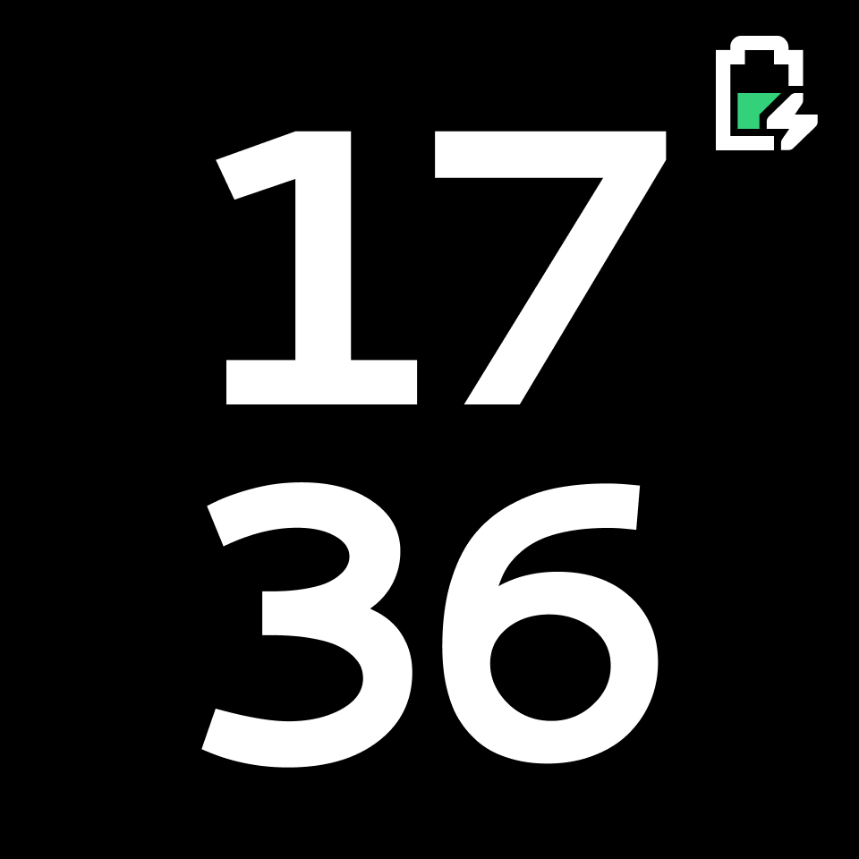
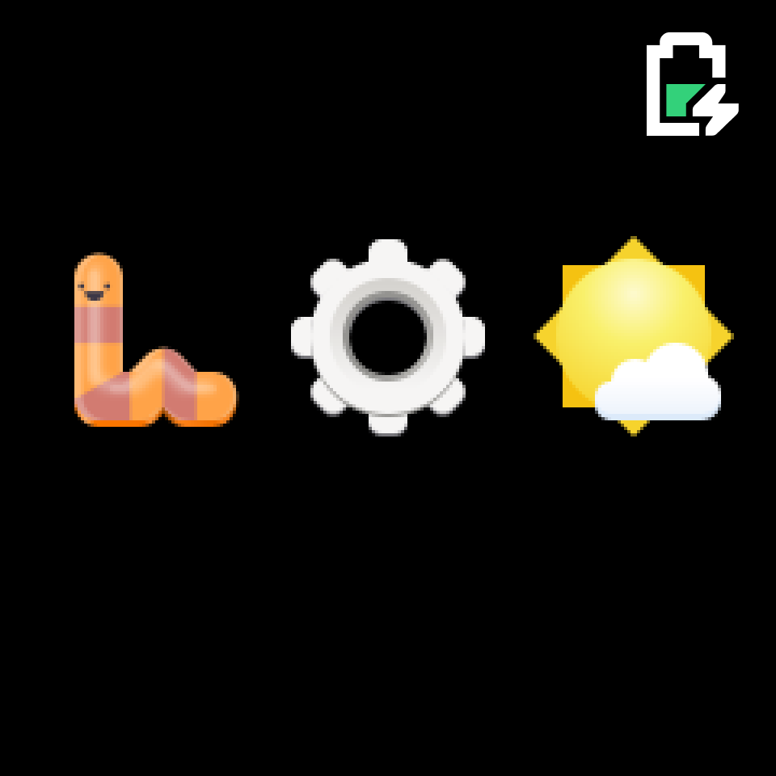

# PineTime UI design proposal

[Figma Prototype](https://www.figma.com/proto/dv6iSTffRz8HnLx8rUfuYZ/v3?node-id=4%3A5&scaling=scale-down&page-id=0%3A1&starting-point-node-id=4%3A5)

This repository contains designs and assets for [Malila](https://github.com/arteeh/malila), a smartwatch operating system. The icons I use for apps and symbols are taken from the [GNOME Project](https://gnome.org), more specifically the [Adwaita theme](https://github.com/GNOME/adwaita-icon-theme).

## Core OS

Unless screen space is extremely scarce, screens will have a Top Bar which shows the time on the left and the battery icon on the right. These stay on the screen when swiping other screens (that have the Top Bar). Home (with the default watch face) only shows the battery.

### Home

The main watchface. Gets shown on button press / screen enable. This is the default watch face, but other watchfaces can be installed.

### App Grid

Shows a 3x2 grid of app icons (and the title of the app, if there's space for that). If there are more than 6 apps, you can swipe right to see more apps.

### Notifications

To the left of your home screen you'll see your notifications. If there are more than can fit on the screen, you can scroll down to see the rest. Tap on a notification to instantly go to the relevant app if there is one. Swipe a notification to the right to remove it.

## Apps

### Calculator

A simple calculator app. It should preferably be easy to calculate tips.

### Clock

A stopwatch, timer and alarm app.

### Music

Control music playback of your phone through Bluetooth.

### Weather

See a nice overview of the weather. Show the temperature, humidity, etc. This is completely reliant on smartphone app functionality.

### Health

Read your heartbeat, step count and sleep tracking information. In text or possibly in graphs.

### Settings

This app is used to customize your watch and connect to your phone with Bluetooth. The app shows a list of all the settings in which you can scroll up and down.

##### Brightness

Change the brightness of the screen. A slider can be moved to set the brightness from 0 to 100.

##### Bluetooth

This screen shows Bluetooth settings:
- Connect to device (show pairing code and confirmation buttons here)
- Disconnect from device
- Turn bluetooth on/off

##### Favourite apps

This setting allows you to set which apps are your favorites. These will then be shown in order if you swipe right from the home screen.

##### Notifications

This screen shows notification settings, if there is a notification feature.
- Vibrate on incoming notification?
- Switch to notification on incoming notification?
- Turn on display on incoming notification?

##### Display

This screen lets you choose between the following options:
- Choose when the display turns on:
	- Keep the display always on
	- Turn on the display when holding the watch upwards, or on tap or button press.
	- Turn on the display on tap or button press
	- Turn on the display on button press only
- Time until the display goes back to sleep (options: 5s, 10s, 30s, off)

##### Reset this device

This shows a confirmation dialog on whether the user wants to reboot the device. When 'yes' is pressed, reboot the device. On 'no', go back to the settings screen.